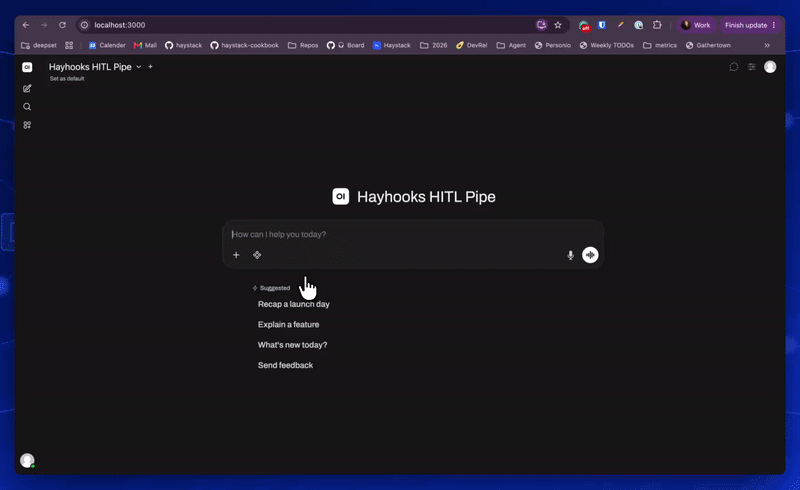
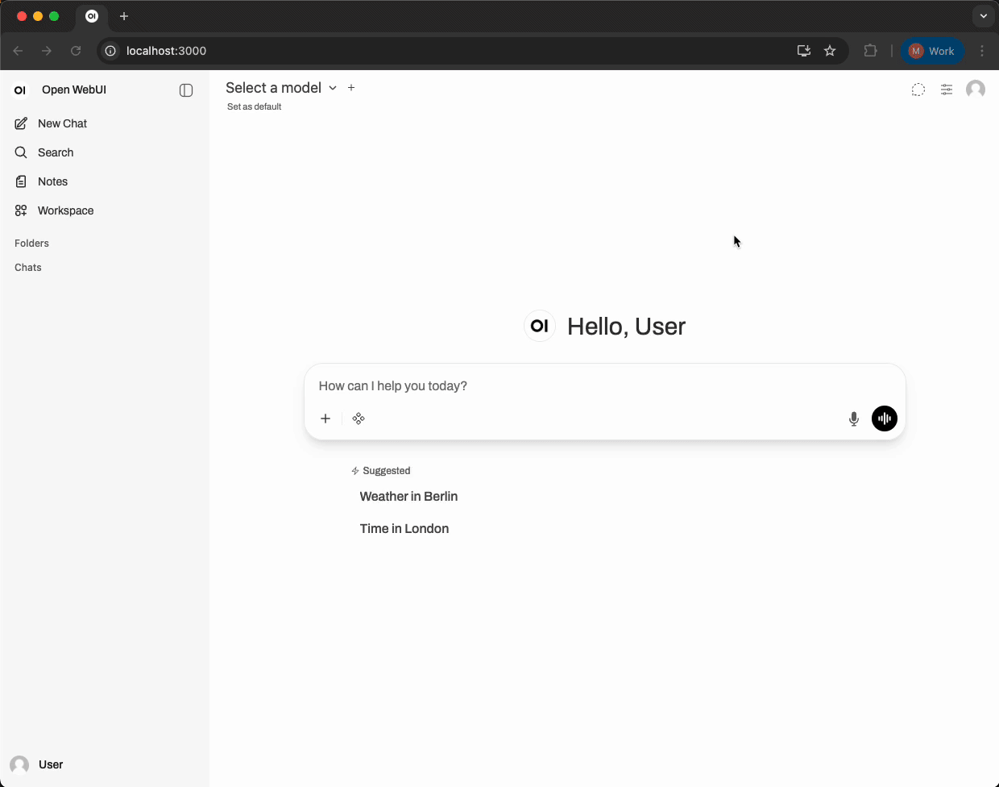

# Hayhooks HITL (Human-in-the-Loop) with Open WebUI

A Redis-based Human-in-the-Loop implementation for Hayhooks / Haystack Agents, integrated with Open WebUI for interactive tool approval workflows.

The default pipeline is a **Haystack 3.0 Launch Week Concierge**: it answers questions about the
launch week, explains new features, and recommends deepset-ai repos freely - but the moment it
wants to post anonymous feedback to deepset's Slack on your behalf, a human has to approve it first.



## Table of Contents

- [Overview](#overview)
- [Architecture](#architecture)
  - [Request Flow](#request-flow)
  - [Detailed Flow Diagram](#detailed-flow-diagram)
- [Prerequisites](#prerequisites)
- [Quick Start with Docker Compose](#quick-start-with-docker-compose)
- [Manual Installation (Alternative)](#manual-installation-alternative)
  - [1. Set Up Python Environment](#1-set-up-python-environment)
  - [2. Start Redis](#2-start-redis)
  - [3. Start Hayhooks Server](#3-start-hayhooks-server)
  - [4. Start Open WebUI](#4-start-open-webui)
  - [5. Deploy and Configure the Pipe Function](#5-deploy-and-configure-the-pipe-function)
- [Usage](#usage)
- [Configuration](#configuration)
  - [Environment Variables (Hayhooks)](#environment-variables-hayhooks)
  - [Open WebUI Pipe Valves](#open-webui-pipe-valves)
- [Available Tools](#available-tools)
- [Adding Custom Tools](#adding-custom-tools)
- [Troubleshooting](#troubleshooting)
  - [Connection Refused to Hayhooks](#connection-refused-to-hayhooks)
  - [Redis Connection Error](#redis-connection-error)
  - [Tool Call Timeout](#tool-call-timeout)
  - [SSE Streaming Issues](#sse-streaming-issues)
- [How It Works](#how-it-works)
  - [Pipeline Side](#pipeline-side-pipelineshitlpipeline_wrapperpy)
  - [UI Side](#ui-side-open-webui-pipepy)
- [License](#license)

## Overview

This implementation allows users to approve or reject tool calls made by a Haystack Agent in real-time through Open WebUI's confirmation dialogs.

The system consists of two main components:

- **`pipelines/hitl/pipeline_wrapper.py`** - A Hayhooks pipeline containing a Haystack Agent with Redis-based HITL confirmation strategy
- **`open-webui-pipe.py`** - A Pipe function deployed in Open WebUI that bridges the frontend with Hayhooks

Redis is used as a message broker to coordinate approval decisions between the Pipe function and the backend pipeline.

## Architecture

```text
┌─────────────────┐         ┌─────────────────┐     HTTP/SSE      ┌─────────────────┐
│                 │         │                 │ ───────────────▶  │                 │
│   Open WebUI    │ ──────▶ │   Pipe Function │                   │    Hayhooks     │
│   (Frontend)    │ ◀────── │ (open-webui-    │ ◀───────────────  │    (Server)     │
│                 │         │     pipe.py)    │   SSE Events      │                 │
└─────────────────┘         └────────┬────────┘                   └────────┬────────┘
                                     │                                     │
                                     │  ┌─────────────────┐                │
                                     │  │                 │                │
                                     └─▶│     Redis       │◀──────────────┘
                                        │    (Broker)     │
                                        │                 │
                                        └─────────────────┘
```

### Request Flow

1. **User sends message** → Open WebUI frontend calls the Pipe function (`open-webui-pipe.py`)
2. **Pipe forwards request** → Pipe function makes HTTP POST to Hayhooks (`/hitl/run`)
3. **Agent processes** → Hayhooks streams SSE events back to the Pipe function
4. **Tool call detected** → Agent emits `tool_call_start` event via SSE
5. **Approval requested** → Pipe function shows confirmation dialog to user via Open WebUI
6. **User decides** → Pipe function sends approval/rejection to Redis (`LPUSH`)
7. **Pipeline unblocks** → Hayhooks reads from Redis (`BLPOP`) and continues
8. **Result streamed** → Pipe function receives response and streams it back to Open WebUI frontend

### Detailed Flow Diagram

```text
Open WebUI                                                   Hayhooks
Frontend              Pipe Function                          /Agent                 Redis
 │                        │                                    │                       │
 │"Tell the deepset team  │                                    │                       │
 │  I love the HITL hooks"│                                    │                       │
 │───────────────────────▶│                                    │                       │
 │                        │  POST /hitl/run                    │                       │
 │                        │───────────────────────────────────▶│                       │
 │                        │                                    │                       │
 │                        │    SSE: tool_call_start            │                       │
 │                        │◀───────────────────────────────────│                       │
 │                        │                                    │   BLPOP (waiting)     │
 │                        │                                    │──────────────────────▶│
 │  🔧 Approve feedback?  │                                    │                       │
 │◀───────────────────────│                                    │                       │
 │                        │                                    │                       │
 │  ✅ Yes / ❌ No         │                                    │                       │
 │───────────────────────▶│                                    │                       │
 │                        │   LPUSH "approved"                 │                       │
 │                        │───────────────────────────────────────────────────────────▶│
 │                        │                                    │   (unblocks)          │
 │                        │                                    │◀──────────────────────│
 │                        │                                    │                       │
 │                        │    SSE: text (result)              │                       │
 │                        │◀───────────────────────────────────│                       │
 │  "Feedback submitted   │                                    │                       │
 │   anonymously"         │                                    │                       │
 │◀───────────────────────│                                    │                       │
 │                        │                                    │                       │
```

## Prerequisites

- **Docker** and **Docker Compose**
- **OpenAI API key** (or compatible LLM endpoint)

## Quick Start with Docker Compose

The easiest way to get started is using Docker Compose, which sets up all services (Redis, Hayhooks, Open WebUI) automatically.

### 1. Set your OpenAI API key and start all services

```bash
export OPENAI_API_KEY="your-api-key-here"
docker compose up -d --build
```

This starts:

- **Redis** on port 6379
- **Hayhooks** on port 1416 (with the HITL pipeline loaded)
- **Open WebUI** on port 3000

### 2. Deploy the Pipe Function to Open WebUI

Follow [Deploy and Configure the Pipe Function](#5-deploy-and-configure-the-pipe-function) section instructions to deploy the Pipe Function to Open WebUI.

---

## Manual Installation (Alternative)

If you prefer to run services manually without Docker Compose:

### 1. Set Up Python Environment

```bash
# Create virtual environment
python -m venv .venv
source .venv/bin/activate  # Linux/macOS
# .venv\Scripts\activate   # Windows

# Install dependencies for Hayhooks server
pip install -r requirements.txt
```

### 2. Start Redis

```bash
docker run -d --name redis -p 6379:6379 redis:alpine
```

### 3. Start Hayhooks Server

```bash
# Set your OpenAI API key
export OPENAI_API_KEY="your-api-key-here"

# Redis defaults to localhost:6379, override if needed:
# export REDIS_HOST="localhost"
# export REDIS_PORT="6379"

# Start Hayhooks and deploy the pipeline
hayhooks run
```

Hayhooks will start on `http://localhost:1416` and automatically load `pipelines/hitl/pipeline_wrapper.py`.

### 4. Start Open WebUI

```bash
docker run -d \
  --name open-webui \
  -p 3000:8080 \
  -e WEBUI_AUTH=False \
  -v open-webui:/app/backend/data \
  --add-host=host.docker.internal:host-gateway \
  ghcr.io/open-webui/open-webui:main
```

### 5. Deploy and Configure the Pipe Function

**NOTE**: This step can be automated, but will require to _enable authentication_ in Open WebUI, in order to get a JWT token and use it in the curl command. For this demo, since it's a one-time setup, we'll do it manually.



1. Open <http://localhost:3000> in your browser
2. Go to **Settings** → **Admin Settings**
3. Select **Functions** from top bar
4. Copy the contents of `open-webui-pipe.py` into the editor
5. Give a title, name and description to the function
6. Save and enable the function
7. **Important:** Update the Valves for manual setup:
   - `BASE_URL`: `http://host.docker.internal:1416`
   - `REDIS_HOST`: `host.docker.internal`

## Usage

1. In Open WebUI, start a new chat
2. Select the **Hayhooks HITL Pipe** as your model (this routes requests through the Pipe function)
3. Ask something that triggers a tool call, e.g.:
   - _"What's new today in Haystack 3.0 Launch Week?"_ (`whats_new_today`, read-only)
   - _"What happened on day 2 of launch week?"_ (`get_launch_week_day`, read-only)
   - _"What are Agent hooks?"_ (`explain_feature`, read-only)
   - _"What repo should I look at for deploying pipelines?"_ (`recommend_repo`, read-only)
   - _"How do I write a custom Haystack component?"_ (`search_haystack_docs`, read-only, queries [Haystack's hosted docs MCP server](https://docs.haystack.deepset.ai/docs/docs-mcp-server) live)
   - _"Tell the deepset team I love the HITL hooks"_ (`submit_feedback_to_deepset`, requires approval)
4. The Pipe function will forward your message to Hayhooks
5. When the Agent decides to call a tool, a confirmation dialog will appear
6. Click **Confirm** to approve or **Cancel** to reject the tool execution
7. For `submit_feedback_to_deepset`, approving posts the message straight to deepset's Slack -
   no email or other personal details are ever collected from you
8. The response will stream back through the Pipe function to your chat

## Configuration

### Environment Variables (Hayhooks)

| Variable | Default | Description |
|----------|---------|-------------|
| `OPENAI_API_KEY` | - | Required. Your OpenAI API key |
| `REDIS_HOST` | `localhost` | Redis server hostname |
| `REDIS_PORT` | `6379` | Redis server port |
| `DEMO_MODE` | `true` | When `true` (default), simulates posting. Set to `false` to post your message to a demo Slack workspace |
| `SLACK_WEBHOOK_URL` | demo webhook (Compose) | Slack Incoming Webhook URL to post feedback to (required if `DEMO_MODE=false`; Compose defaults to a demo workspace) |

### Open WebUI Pipe Valves

| Valve | Docker Compose | Manual Setup | Description |
|-------|----------------|--------------|-------------|
| `BASE_URL` | `http://hayhooks:1416` | `http://host.docker.internal:1416` | Hayhooks server URL |
| `PIPELINE_NAME` | `hitl` | `hitl` | Pipeline endpoint name |
| `REDIS_HOST` | `redis` | `host.docker.internal` | Redis host |
| `REDIS_PORT` | `6379` | `6379` | Redis port |

> **Note:** The defaults in `open-webui-pipe.py` are configured for Docker Compose. For manual setup, update the Valves via **Admin Panel** → **Functions** → **Hayhooks HITL Pipe** → ⚙️

## Available Tools

The default configuration is a Haystack 3.0 Launch Week Concierge, with a deliberate split between
read-only tools that execute immediately and the one consequential tool that requires human approval:

| Tool | Description | Requires Approval? |
|------|-------------|---------------------|
| `get_launch_week_day` | Get the theme, summary, and link for a specific launch week day (1-5) | No (read-only) |
| `whats_new_today` | Get today's launch week drop, based on the current date | No (read-only) |
| `recommend_repo` | Recommend relevant deepset-ai GitHub repos for a given interest | No (read-only) |
| `explain_feature` | Explain a specific Haystack 3.0 feature (hooks, skills, agent pack, etc.) | No (read-only) |
| `search_haystack_docs` | Search the live Haystack documentation via deepset's hosted [docs MCP server](https://docs.haystack.deepset.ai/docs/docs-mcp-server) | No (read-only) |
| `submit_feedback_to_deepset` | Post anonymous feedback (a question, comment, or feature request) to deepset's Slack | Yes (posts to a real channel) |

Which tools require approval is controlled entirely by which ones are registered in the
`ConfirmationHook`'s `confirmation_strategies` dict in `pipeline_wrapper.py` — a tool left out of
that dict executes immediately, with no human in the loop.

`search_haystack_docs` is a real [MCPTool](https://docs.haystack.deepset.ai/docs/mcptool) connecting
to deepset's public docs MCP server over Streamable HTTP - no API key needed. The connection is lazy
(`eager_connect=False`, the default), so it doesn't block pipeline startup on an external network call,
and only connects the first time the tool is actually used.

`submit_feedback_to_deepset` is the sensitive action itself: once approved, it posts straight to
a Slack channel via an Incoming Webhook, with nothing left for a human to do afterward - which is
exactly why it requires approval first, rather than just drafting something for the user to send.
No email or other personal details are ever collected, so the feedback is fully anonymous. See
[Environment Variables (Hayhooks)](#environment-variables-hayhooks) for configuring the webhook.

## Adding Custom Tools

Edit `pipelines/hitl/pipeline_wrapper.py` to add your own tools:

```python
from haystack.tools import create_tool_from_function

def my_custom_tool(param: str) -> str:
    """Your tool description."""
    return f"Result for {param}"

custom_tool = create_tool_from_function(
    function=my_custom_tool,
    name="my_custom_tool",
    description="Description shown to the LLM",
)

# Add to the agent tools list. Only add it to the ConfirmationHook's confirmation_strategies
# dict if it should require human approval before running - leave it out for tools that are
# safe to auto-execute (e.g. read-only lookups).
self.agent = Agent(
    # ...
    tools=[get_launch_week_day_tool, whats_new_today_tool, recommend_repo_tool, custom_tool],
    hooks={
        "before_tool": [
            ConfirmationHook(
                confirmation_strategies={
                    # ...
                    custom_tool.name: self.confirmation_strategy,
                }
            )
        ]
    },
)
```

## Troubleshooting

### Connection Refused to Hayhooks

- Ensure Hayhooks is running: `curl http://localhost:1416/status`
- **Docker Compose:** Use `http://hayhooks:1416` in Valve settings
- **Manual setup:** Use `http://host.docker.internal:1416` in Valve settings

### Redis Connection Error

- Check Redis is running: `redis-cli ping` (should return `PONG`)
- **Docker Compose:** Set `REDIS_HOST` valve to `redis`
- **Manual setup:** Set `REDIS_HOST` valve to `host.docker.internal`
- Verify host/port configuration in both pipeline and pipe

### Tool Call Timeout

- Default timeout is 5 minutes
- Check Redis connectivity between all services
- Verify the pipe is correctly sending approvals to the same Redis instance

### SSE Streaming Issues

- Ensure `Accept: text/event-stream` header is set
- Check for proxy/firewall issues that might buffer SSE

## How It Works

### Pipeline Side (`pipelines/hitl/pipeline_wrapper.py`)

The `RedisConfirmationStrategy` class implements Haystack's `ConfirmationStrategy` interface:

1. When a tool call is initiated, it emits a `tool_call_start` event to the async queue (obtained from `confirmation_strategy_context`)
2. It then waits on Redis `BLPOP` for an approval decision (using the Redis client from `confirmation_strategy_context`)
3. Once approval is received, it returns a `ToolExecutionDecision` object
4. The agent proceeds to execute (or skip) the tool based on the decision

The per-request state (event_queue, redis_client) is passed as the `hook_context` argument when calling `agent.run_async()`. The `ConfirmationHook` (registered on the Agent's `before_tool` hook point) reads this dict from the Agent state and hands it to the strategy's `run_async()` as the `confirmation_strategy_context` keyword argument.

### UI Side (`open-webui-pipe.py`)

The Pipe function acts as a bridge between the Open WebUI frontend and Hayhooks:

1. Receives chat messages from the Open WebUI frontend
2. Forwards the request to Hayhooks via HTTP POST (`/hitl/run`)
3. Streams SSE events from Hayhooks back to the frontend
4. When it receives a `tool_call_start` event, it shows a confirmation dialog to the user via `__event_call__`
5. Based on user response, it sends `approved` or `rejected` to Redis via `LPUSH`
6. Continues streaming the response back to the Open WebUI frontend

## License

MIT
